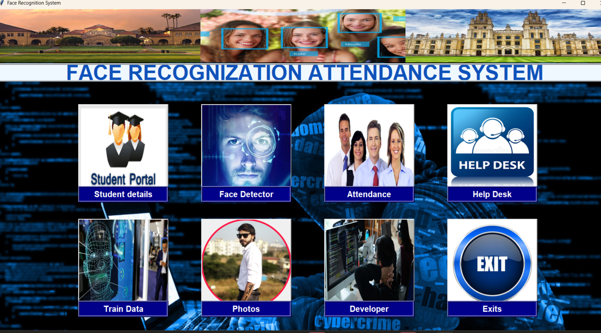
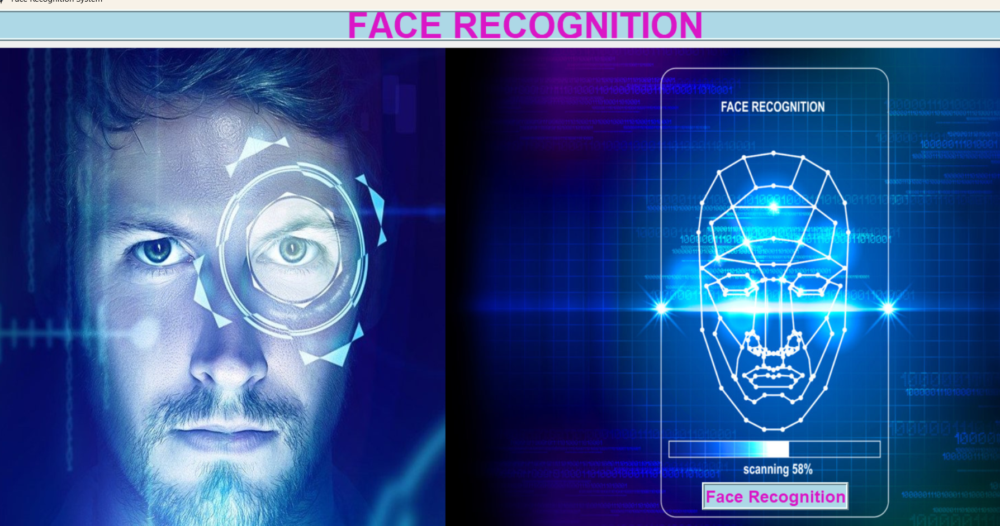

# 🎯 Face Recognition Attendance System

## 📌 Overview
This is a **real-time face recognition attendance system** built in Python using **OpenCV (LBPH algorithm)**, **Tkinter GUI**, and **MySQL database**.  
It detects and recognizes faces from a webcam feed, matches them with stored student data, and logs attendance in a CSV file automatically with the student’s details.

This project is useful for:
- Schools, colleges, or offices to automate attendance
- Learning computer vision with OpenCV
- Understanding MySQL-Python integration

## 🚀 Features
- 🎥 **Real-time Face Detection & Recognition** using Haar Cascade + LBPH
- 🖥 **Tkinter GUI** for easy usage
- 🗄 **MySQL Database** for student info (Name, Roll, Department)
- 📝 **CSV Attendance Logging** with:
  - ID
  - Roll Number
  - Name
  - Department
  - Date & Time
  - Status ("Present")
- 📂 **Separate Training Module** to train the model with new student faces

## 🛠 Tech Stack
**Programming Language**: Python  
**Libraries**: OpenCV, Pillow, NumPy, Tkinter, mysql-connector-python  
**Database**: MySQL (Workbench recommended)  
**Tools**: VS Code / PyCharm, MySQL Workbench, Git


## Screenshots

### Main Dashboard


### Face Recognition Module


### Student Management System


🔮 Future Scope
Use deep learning-based recognition (FaceNet, DeepFace)

Cloud-based attendance storage

Email/SMS attendance alerts

🏁 Conclusion
The Face Recognition Attendance System successfully demonstrates the integration of computer vision, machine learning (LBPH algorithm), and database management (MySQL) to automate the attendance process.

This project offers:

Accuracy & Efficiency in detecting and marking attendance in real-time.

User-friendly Interface built with Tkinter for ease of operation.

Scalability to handle large datasets and integrate with existing academic or corporate systems.

Future enhancements can include adding deep learning-based face recognition models, cloud integration, and multi-camera support to further improve performance and deployment capabilities.

👩‍💻 Author
Priya Maheswari
📧 priyamh000128@gmail.com

## ⚙️ Installation & Setup
```bash
git clone https://github.com/Priyamah28/face-recognition-attendance.git
cd face-recognition-attendance

